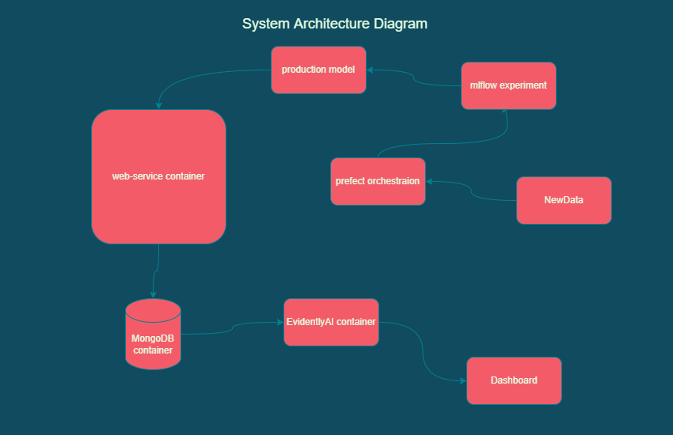

# System Archietecture Design

# To run the pipeline orchestration

## To start the mlflow and prefect server
1. mlflow server --backend-store-uri sqlite:///mlflow.db --default-artifact-root ./artifacts
2. prefect orion start

## create the storage for prefect
1. prefect storage create
2. select local storage
3. give path "./.prefect"
4. prefect storage ls
5. copy the id of storage
6. prefect storage set-default 'id'

## deploy the training flow
1. prefect deployment create pipeline-deployment.py
2. Create a worker with subprocess using the prefect ui
3. prefect agent start 'workerid'

# To start the prediction webservice and monitoring service
1. In docker-compose.yml file you can provide the env varibles with run id and exp_id for the best experiment.
The webservice app will pick up the model from the artifacts and deploy it.

2. Prediction webservice will serve at "http://localhost:8000/prediction"
3. You can send json payload with your values to this service in the given format.
    {"AT_1": at_1, "AT_2": at_2}
4. You can also access the SwaggerUI for interactive usage and try out the API at "http://localhost:8000/docs"

5. For simulating production usage, run the send_data.py script. It will send continuous requests to the API and fill the MongoDB database with the parameters, that monitoring service will use to generate Data Drift reports.

6. In order to Fetch the DataDrift Dashboard from the monitoring service, Go to the url "http://127.0.0.1:8001/get_dashboard" , wait for sometime for the application to load the latest Dashboard.

** If you don't want to launch the training job, you can directly do docker-compose up to start the services.
